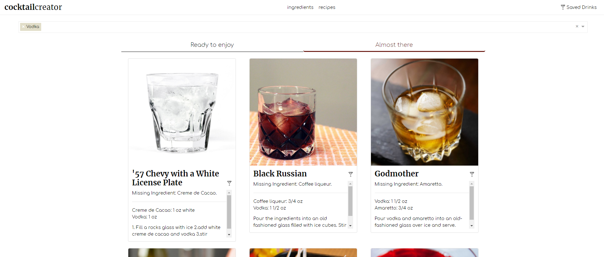

# Cocktail Creator

Format: 

Our app was created to help users create fantastic drinks using only the ingredients they have available.

The typeahead software predicts what the user is going to input, and shows potential recipes based on the ingredients provided.

## Mission

> Our mission was to create a seamless
> drink forging experience that hepls the user.
> Instead of relying on recipes to make drinks, 
> our app lets you see what can make based on 
> what you already have at home.

## New Features!

  - Added a favorites page and button so logged in users can save their favorite recipes for later.
  - Added React for the front end design.
  - Added Passport.js for authentication and user login.
  - Used a new UI/UX design to redo the front-end
  - Designed with web first strategy which works seamlessly with mobile.

## Technologies 

Cocktail Creator relies on many different technologies to function. While we are using another companies API to provide the drink recipes and images, everything else was coded from scratch. 

* Javascript - main functional language
* React - javascript framework used to build new design
* Visual Studio Code - text editor
* [Twitter Bootstrap] - great UI boilerplate for modern web apps
* [node.js] - evented I/O for the backend
* [Express] - fast node.js network app framework 
* [jQuery] - duh
* [Passport.js] - user authentication and login

   [Visual Studio]: <https://visualstudio.microsoft.com>
   [Ace Editor]: <http://ace.ajax.org>
   [node.js]: <http://nodejs.org>
   [Twitter Bootstrap]: <http://twitter.github.com/bootstrap/>
   [jQuery]: <http://jquery.com>
   [express]: <http://expressjs.com>
   [React]: <http://reactjs.org>
   [ESLint]: <http://eslint.com>