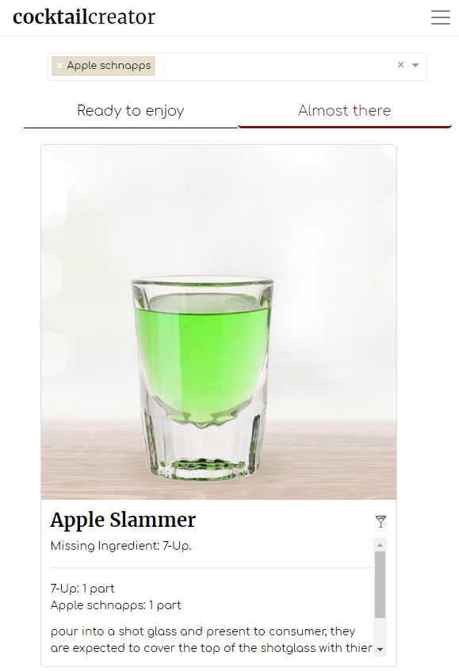
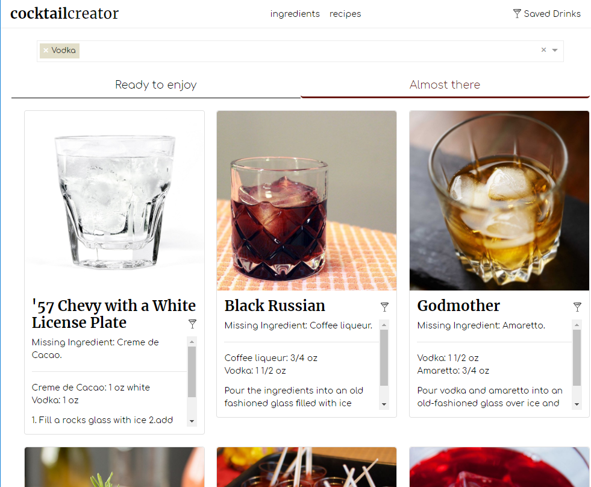

# Cocktail Creator

Our app was created to help users create fantastic drinks using only the ingredients they have available.

The typeahead assists users in sorting through a large ingredient list while preventing common spelling mistakes and finding related items (ie: Vodka, Lemon Vodka).

## Mission

> Our mission was to create a seamless
> drink forging experience for the user.
> Instead of relying on recipes to make drinks, 
> our app lets you see what can make based on 
> what you already have at home.

## New Features!

  - Added a favorites page and button so logged in users can save their favorite recipes for later.
  - Added React for the front end design.
  - Added Passport.js for authentication and user login.
  - Used a new UI/UX design to redo the front-end
  - Designed with web first strategy which works seamlessly with mobile.
  - Allow user to browse all drink recipies from one page utilizing infinity scroll for rapid page load.

## Technologies 

Cocktail Creator relies on many different technologies to function.

* [Javascript] - main functional language
* [React] - javascript framework used to build new design
* [Twitter Bootstrap] - great UI boilerplate for modern web apps
* [node.js] - evented I/O for the backend
* [Express] - fast node.js network app framework 
* [Passport.js] - user authentication and login
* [React Virtualized Select] - Typeahead

   [node.js]: <http://nodejs.org>
   [Twitter Bootstrap]: <http://twitter.github.com/bootstrap/>
   [express]: <http://expressjs.com>
   [React]: <http://reactjs.org>
   [ESLint]: <http://eslint.com>
   [React Virtualized Select]: <https://www.npmjs.com/package/react-virtualized-select>

### Desktop
   
### Tablet

   